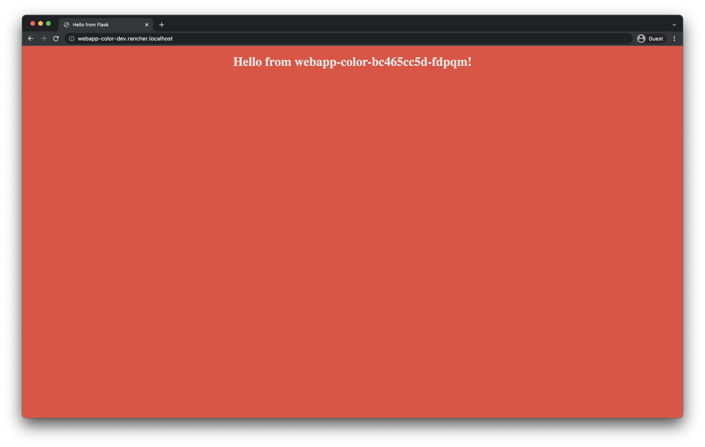
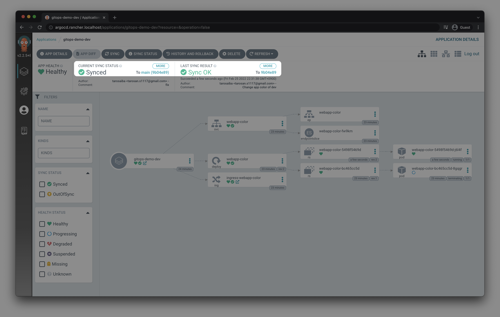
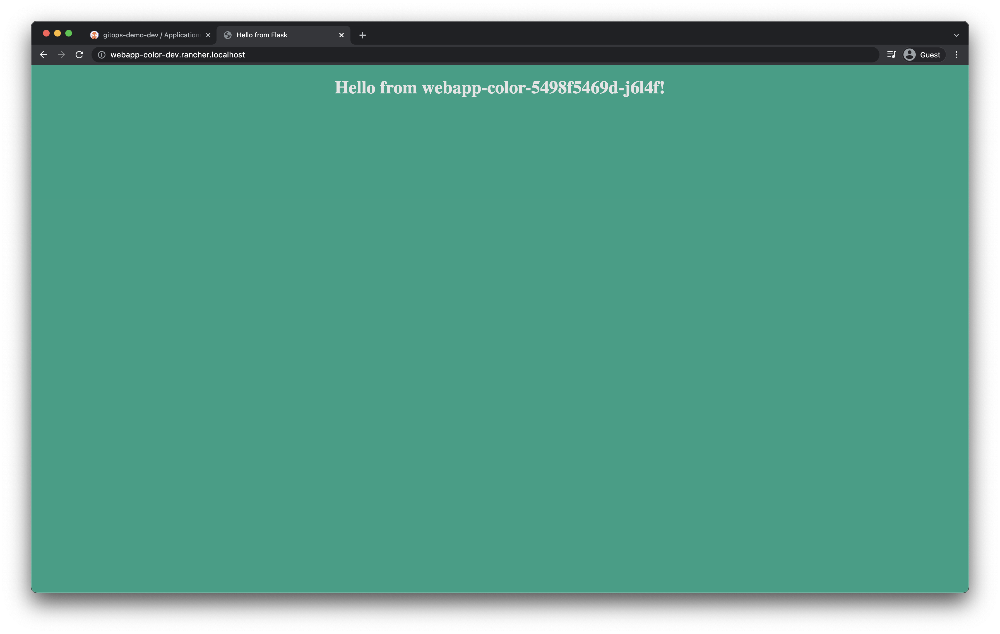

# GitOps(ArgoCD) on local with Rancher Desktop

You can try GitOps locally by deploying ArgoCD on Rancher Desktop k3s

# Requirements
* OS : macOS Big Sur (Intel Mac)
* Rancher Desktop >= `1.0.1`
* Kubernetes >= `v1.22.6`
    - engine: `containerd`
* ArgoCD >= `v2.2.5`

# Quick Start
* Install [Rancher Desktop](https://rancherdesktop.io/) & Start local kubernetes cluster (k3s)
* Clone or download this repository
* Go inside of directory, `cd gitops-demo-local`
* Run this command `./init.sh`
* Get acccess to ArgoCD UI `http://argocd.rancher.localhost`
    - user: admin
    - pass: `kubectl -n argocd get secret argocd-initial-admin-secret -o jsonpath="{.data.password}" | base64 -d; echo`

# Overview


# Screenshots


# Demo
## Apply change

* Check before applying change.
    - URL: `http://webapp-color-dev.rancher.localhost`


* Update environment variable of dev webapp-color

```diff
+++ b/deploy/overlays/dev/webapp-color.yaml
@@ -14,5 +14,5 @@ spec:
       - name: webapp-color
         env:
         - name: APP_COLOR
-          value: "red"
+          value: "green"
           # supported color: ["red", "green", "blue", "blue2", "darkblue", "pink"]
```

```
$ git commit deploy/overlays/dev/webapp-color.yaml -m "Change app color of dev"                                                                                                               (main✱)
[main 9b04e89] Change app color of dev
 1 file changed, 1 insertion(+), 1 deletion(-)

$ git push origin main                                                                                                                                                                        (main✱)
Enumerating objects: 11, done.
[..]
To github.com:tarosaiba/argocd-on-rancher-desktop.git
   29c5749..9b04e89  main -> main
```

* Wait 3min (ArgoCD auto sync interval is 3min)
    - You can see commit id `9b04e89` at CURRENT SYNC STATUS



* The changes have been successfully applied!
    - URL: `http://webapp-color-dev.rancher.localhost`


