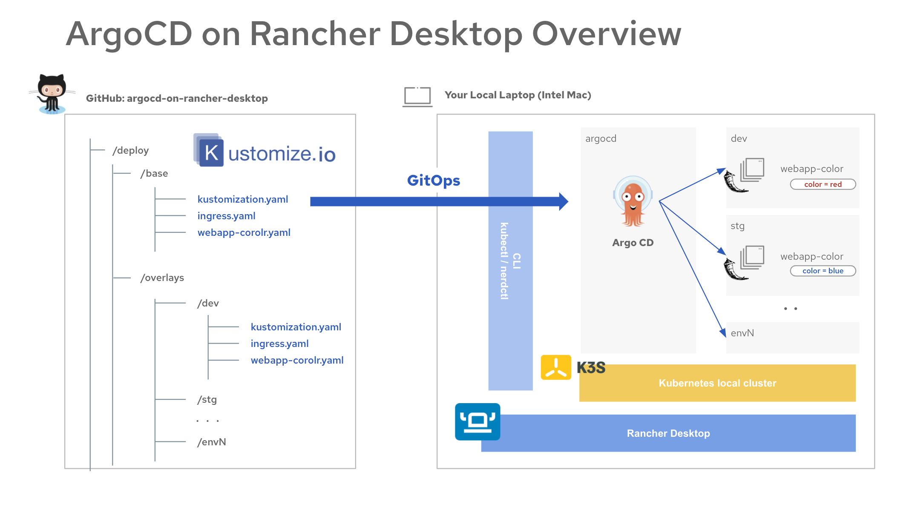
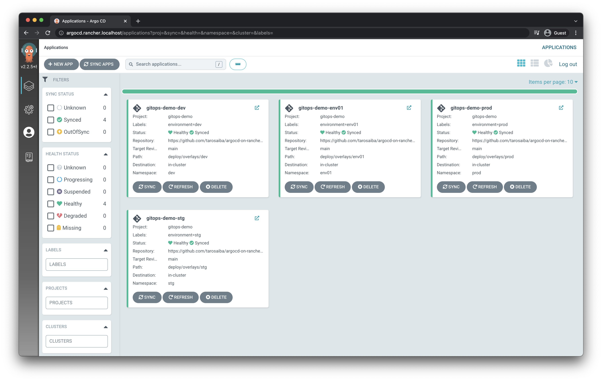

# GitOps on local with Rancher Desktop

You can try GitOps locally by deploying ArgoCD on Rancher Desktop k3s

# Requirements
* OS : macOS Big Sur (Intel Mac)
* Rancher Desktop >= `1.0.1`
* Kubernetes >= `v1.22.6`
    - engine: `containerd`
* ArgoCD >= `v2.2.5`

# Quick Start
* Install [Rancher Desktop](https://rancherdesktop.io/) & Start local kubernetes cluster (k3s)
* Clone or download this repository
* Go inside of directory, `cd gitops-demo-local`
* Run this command `./init.sh`
* Get acccess to ArgoCD UI `http://argocd.rancher.localhost`
    - user: admin
    - pass: `kubectl -n argocd get secret argocd-initial-admin-secret -o jsonpath="{.data.password}" | base64 -d; echo`

# Overview

# Screenshots

